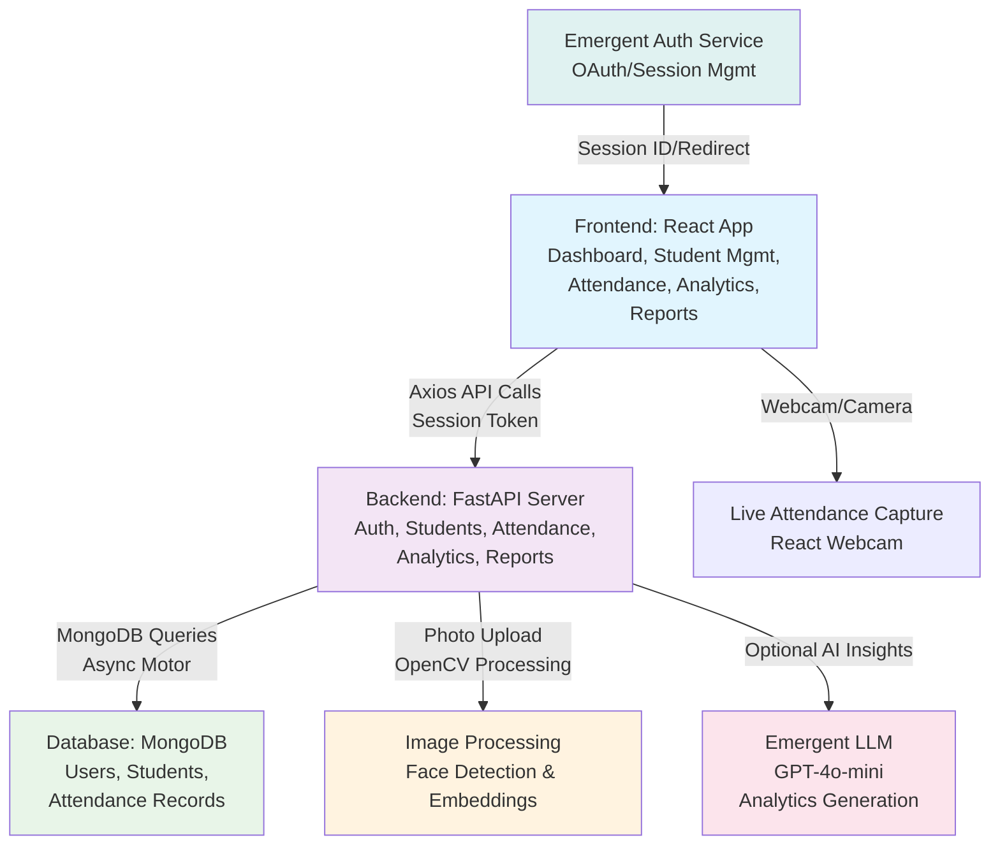

# Shiksha-Connect Attendance Management System

[](https://www.python.org/)
[](https://fastapi.tiangolo.com/)
[](https://reactjs.org/)
[](https://www.mongodb.com/)

Shiksha-Connect is a comprehensive, full-stack attendance management system designed for educational institutions. It enables teachers, administrators, and district officers to efficiently track student attendance using manual entry, facial recognition (with photo processing), or RFID methods. The system provides real-time dashboards, AI-powered analytics for insights, detailed reporting, and role-based access control. Built with modern technologies, it integrates seamlessly with external authentication services and optional AI enhancements for educational decision-making.

## Features

- **Role-Based Authentication**: Secure login via Emergent Auth (OAuth), supporting teachers, administrators, and district officers with appropriate permissions.
- **Student Management**: Add, view, and manage student profiles including personal details, class/section assignment, parent information, and photo uploads with basic facial recognition preprocessing (using OpenCV for face detection and placeholder embeddings).
- **Multi-Method Attendance Marking**: Mark attendance manually, via facial recognition (processed images stored as base64 with embeddings), or RFID. Supports bulk operations for classes.
- **Real-Time Dashboard**: Overview of daily attendance rates, trends over the last 7 days, total students, and role-specific metrics.
- **AI-Powered Analytics**: Generate actionable insights using Emergent LLM integration (GPT-4o-mini) to analyze attendance patterns and provide recommendations for school administrators.
- **Reporting & Exports**: Filterable reports by date range, class, section, or school/district. Enriched with student details for comprehensive views.
- **Classes & Sections**: Organized student grouping with aggregation for easy navigation.
- **Image Processing**: Secure photo upload handling with face detection, resizing, and embedding generation for future recognition features.
- **Responsive UI**: Modern React interface with Tailwind CSS, Radix UI components, and Recharts for visualizations.

## Architecture

The system follows a client-server architecture with asynchronous operations for scalability.



- **Frontend**: Handles UI routing, API interactions, and local state management.
- **Backend**: Exposes RESTful APIs with authentication middleware.
- **Database**: NoSQL for flexible schema handling attendance and student data.
- **Integrations**: External auth and AI services for extensibility.

## Tech Stack

### Backend
- **Framework**: FastAPI (async Python web framework)
- **Database**: MongoDB (with Motor for async operations)
- **Image Processing**: OpenCV, Pillow (PIL)
- **Authentication**: HTTPBearer with session tokens; integrates with Emergent Auth
- **AI Integration**: Emergent LLM (optional GPT-4o-mini via OpenAI)
- **Other**: Pydantic for models, bcrypt for hashing, CORS middleware

### Frontend
- **Framework**: React 18 with React Router for SPA navigation
- **Styling**: Tailwind CSS, Radix UI primitives for accessible components
- **State & Forms**: React Hook Form, Zod for validation
- **API Client**: Axios with cookie-based auth
- **UI/UX**: Framer Motion for animations, Recharts for charts, Sonner for toasts
- **Build Tools**: CRACO for Tailwind integration, Yarn as package manager

### Deployment & DevOps
- Environment: Docker-compatible structure
- Testing: Basic unit tests (extendable)
- Logging: Python logging module

## Prerequisites

Before installation:
- Python 3.8+
- Node.js 18+ and Yarn 1.22+
- MongoDB (local or cloud instance, e.g., MongoDB Atlas)
- Git for cloning the repository
- Optional: Emergent API key for AI features and auth
- OpenCV dependencies (install via system package manager if needed, e.g., `brew install opencv` on macOS)

Set up environment variables in `.env` files (see installation).

## Installation

### Backend Setup
1. Navigate to the backend directory:
   ```
   cd backend
   ```

2. Install dependencies:
   ```
   pip install -r requirements.txt
   ```
   (Or use `requirements_modified.txt` if custom versions are needed.)

3. Configure environment variables in `backend/.env`:
   ```
   MONGO_URL=mongodb://localhost:27017/shiksha_connect
   DB_NAME=shiksha_connect
   CORS_ORIGINS=http://localhost:3000
   EMERGENT_LLM_KEY=your_emergent_key_here  # Optional for AI
   ```

4. Run the server:
   ```
   uvicorn server:app --reload --host 0.0.0.0 --port 8000
   ```
   The API will be available at `http://localhost:8000`. Check docs at `http://localhost:8000/docs`.

### Frontend Setup
1. Navigate to the frontend directory:
   ```
   cd frontend
   ```

2. Install dependencies:
   ```
   yarn install
   ```

3. Configure environment variables in `frontend/.env`:
   ```
   REACT_APP_BACKEND_URL=http://localhost:8000
   ```

4. Start the development server:
   ```
   yarn start
   ```
   The app will open at `http://localhost:3000`.

### Database Setup
- Install and run MongoDB locally, or use a cloud service.
- The app auto-creates collections (users, students, attendance) on first use.
- No migrations needed due to NoSQL flexibility.

## Usage

1. **Authentication**: The app uses Emergent Auth. On first visit, it redirects to the login page. Click "Login" to authenticate via the external service. After approval, it processes the session and redirects back.

2. **Dashboard**: View overview stats, today's attendance, and trends.

3. **Student Management** (`/students`): Add students with optional photo upload (face detection applied). View lists filtered by class/section.

4. **Attendance Marking** (`/attendance`): Select date, class, and mark status for students (bulk or individual).

5. **Analytics** (`/analytics`): Generate insights with AI (if enabled) for selected date ranges.

6. **Reports** (`/reports`): Download or view filtered attendance reports.

For demo purposes, roles default to "teacher" on new users. Test with sample data via API docs.

## API Endpoints

All endpoints under `/api` with JWT/session token auth (via cookies or Authorization header).

| Endpoint | Method | Description | Parameters |
|----------|--------|-------------|------------|
| `/auth/session-data` | GET | Process Emergent session and create user | Header: X-Session-ID |
| `/students` | POST | Create student (with photo) | Form data: name, roll_number, etc.; File: photo |
| `/students` | GET | List students | Query: class_name, section |
| `/students/{student_id}` | GET | Get single student | Path: student_id |
| `/attendance/mark` | POST | Mark attendance for students | Body: student_ids[], date, status, method |
| `/attendance` | GET | Get attendance for date | Query: date, class_name, section |
| `/reports/attendance` | POST | Generate report | Body: filters (school_id, dates, etc.) |
| `/analytics/insights` | POST | AI analytics | Body: school_id, date_range, etc. |
| `/analytics/dashboard` | GET | Dashboard data | None (role-based) |
| `/classes` | GET | List classes/sections | None |
| `/auth/logout` | POST | Logout user | None |

Full OpenAPI docs available at `/docs`.

## Development

- **Running Tests**: Backend - `pytest backend_test.py`; Frontend - `yarn test`.
- **Adding Features**: Extend Pydantic models and routes in `server.py`; Add React components in `src/components/`.
- **Facial Recognition**: Currently placeholder embeddings; integrate full ML model (e.g., face_recognition lib) for production.
- **Security**: Ensure HTTPS in production; validate all uploads.
- **Performance**: Use MongoDB indexes on frequent queries (e.g., date, student_id).

## Contributing

Contributions welcome! Fork the repo, create a feature branch, and submit a PR. Focus on:
- Bug fixes
- New features (e.g., email notifications, export to CSV)
- Documentation improvements
- Tests

Please follow PEP 8 for Python and ESLint for JS. See [CONTRIBUTING.md](CONTRIBUTING.md) for details (create if needed).

## License

This project is licensed under the MIT License - see the [LICENSE](LICENSE) file for details.

## Support

- Report issues on GitHub.
- For Emergent integration help: [Emergent Docs](https://docs.emergentagent.com).
- Contact: [Your GitHub](https://github.com/Cyansiiii) or open an issue.

---

*Built with ❤️ for education. Track, analyze, and improve attendance effortlessly.*
